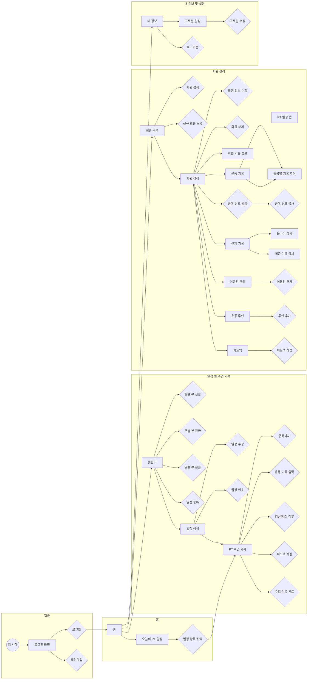

```mermaid
flowchart LR

  subgraph s1 ["인증"]
    n1(("앱 시작"))
    n2["로그인 화면"]
    n3{"로그인"}
    n4{"회원가입"}
  end

  subgraph s2 ["홈"]
    n5["홈"]
    n6["오늘의 PT 일정"]
    n7{"일정 항목 선택"}
  end

  subgraph s3 ["일정 및 수업 기록"]
    n8["캘린더"]
    n9{"월별 뷰 전환"}
    n10{"주별 뷰 전환"}
    n11{"일별 뷰 전환"}
    n12{"일정 등록"}
    n13["일정 상세"]
    n14{"일정 수정"}
    n15{"일정 취소"}
    n16["PT 수업 기록"]
    n17{"종목 추가"}
    n18{"운동 기록 입력"}
    n19{"영상/사진 첨부"}
    n20{"피드백 작성"}
    n21{"수업 기록 완료"}
  end

  subgraph s4 ["회원 관리"]
    n22["회원 목록"]
    n23{"회원 검색"}
    n24{"신규 회원 등록"}
    n25["회원 상세"]
    n26{"회원 정보 수정"}
    n27{"회원 삭제"}
    n28["회원 기본 정보"]
    n29["이용권 관리"]
    n30["PT 일정 탭"]
    n31["운동 기록"]
    n32["운동 루틴"]
    n33["피드백"]
    n36["종목별 기록 추이"]
    n37{"공유 링크 생성"}
    n38{"공유 링크 복사"}
    n43["신체 기록"]
    n44["눈바디 상세"]
    n45["체중 기록 상세"]
    n46{"이용권 추가"}
    n47{"루틴 추가"}
    n48{"피드백 작성"}
  end

  subgraph s5 ["내 정보 및 설정"]
    n39["내 정보"]
    n40["프로필 설정"]
    n41{"프로필 수정"}
    n42{"로그아웃"}
  end

  n1 --> n2
  n2 --> n3
  n2 --> n4
  n3 --> n5
  n5 --> n6
  n6 --> n7
  n7 --> n16
  n5 --> n8
  n5 --> n22
  n5 --> n39
  n8 --> n9
  n8 --> n10
  n8 --> n11
  n8 --> n12
  n8 --> n13
  n13 --> n14
  n13 --> n15
  n13 --> n16
  n16 --> n17
  n16 --> n18
  n16 --> n19
  n16 --> n20
  n16 --> n21
  n22 --> n23
  n22 --> n24
  n22 --> n25
  n25 --> n26
  n25 --> n27
  n25 --> n28
  n25 --> n29
  n25 --> n31
  n25 --> n32
  n25 --> n33
  n25 --> n43
  n31 --> n36
  n25 --> n37
  n37 --> n38
  n39 --> n40
  n40 --> n41
  n39 --> n42
  n31 --> n36
  n43 --> n44
  n43 --> n45
  n29 --> n46
  n32 --> n47
  n33 --> n48
```
