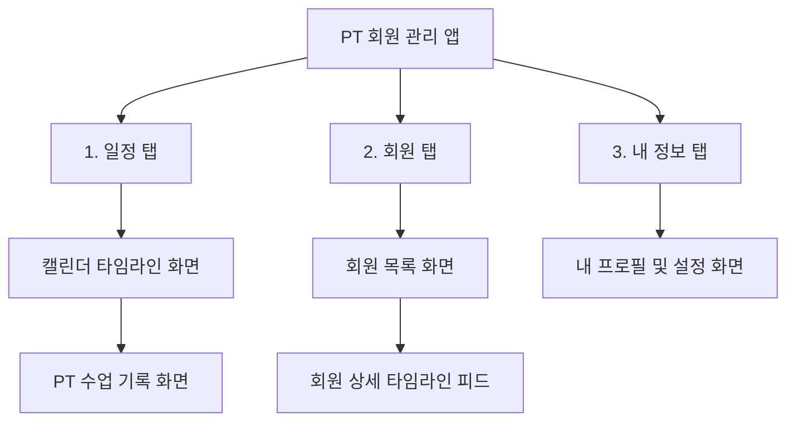

# PT 회원 관리 앱 - 페이지 구조 정의서

|                     |                   |
| ------------------- | ----------------- |
| **프로젝트 이름**   | [PT 회원 관리 앱] |
| **프로젝트 관리자** | 1인 개발자        |
| **날짜**            | 2026-07-13        |

---

## 1. 개요 및 설계 원칙

본 문서는 1인 개발자가 가장 빠르게 프로토타입을 구축하고, 실제 운영 시에도 복잡한 조작 단계를 없애기 위해 설계된 하단 탭 및 페이지 구조(Information Architecture)를 정의합니다.

- **최소한의 탭 구성**: 중복되는 성격의 홈 탭과 일정 탭을 하나로 통합하여 총 3개의 하단 탭으로 구성합니다.
- **불필요한 지표 배제**: 자리 채우기용 요약 통계 지표는 노출하지 않고, 사용자(트레이너)가 즉각적인 예약을 확인하고 기록하는 흐름에 집중합니다.

---

## 2. 하단 탭 구조 요약

---

## 3. 탭별 상세 페이지 및 화면 구성

### 3.1. 일정 (Calendar / 메인 홈) 탭

트레이너가 오늘 해야 할 수업 일정을 한눈에 파악하고 즉시 기록을 시작할 수 있는 화면입니다.

- **[메인] 캘린더 타임라인 화면**
  - 월간(Month) / 주간(Week) / 일간(Day) 달력 선택 영역
  - **오늘의 예약 스케줄 리스트**: 선택한 날짜에 예정된 회원명, 시간, 이용권 잔여 현황 표시 (통계성 요약 지표 배제)
  - 일정 추가/수정/취소 액션 기능 (바텀시트 또는 심플 모달)
- **[서브] PT 수업 기록 작성 화면 (핵심 기록 작업)**
  - 오늘의 일정 목록에서 특정 회원 카드를 터치하면 진입
  - 당일 진행한 운동 종목 선택 및 세트별 무게/횟수 입력 (이전 세트 기록이 힌트로 노출됨)
  - 오늘의 동영상/사진 첨부 및 피드백 텍스트 작성창
  - **[완료]** 버튼: 이용권 1회 자동 차감 후 해당 회원의 타임라인 피드 최상단에 자동 기록 발행

---

### 3.2. 회원 (Members) 탭

등록된 회원들을 관리하고 개별 회원의 성장 추이 및 이용 정보를 밀착 추적하는 화면입니다.

- **[메인] 회원 목록 화면**
  - 회원 검색 및 필터 기능 (진행 중인 회원 / 이용권 만료 회원)
  - 신규 회원 추가 버튼 (바텀시트로 빠른 정보 입력 지원)
- **[상세] 회원 상세 화면 (단일 타임라인 피드 형식)**
  - **상단 영역 (고정)**:
    - 회원 프로필 (이름, 전화번호, 이용권 잔여 횟수)
    - `공유 링크 복사` 버튼 (회원 전송용)
  - **하단 영역 (세로 스크롤 타임라인)**:
    - 탭 구분 없이 **시간 최신순**으로 과거 PT 수업 기록, 작성된 피드백 텍스트, 첨부된 영상/사진, 체중 및 눈바디 기록 카드가 피드 형식으로 나열됨.
    - 트레이너는 다른 탭을 누르는 번거로움 없이 아래로 스크롤하며 회원의 모든 성장 히스토리를 1초 만에 확인.

---

### 3.3. 내 정보 (My Profile) 탭

트레이너 본인 계정 정보와 앱 내 시스템 관련 설정을 관리합니다.

- **[메인] 프로필 및 설정 화면**
  - 트레이너 프로필 정보 (이름, 소속 헬스장) 및 프로필 수정
  - 로그인 정보 (연동된 소셜 계정 상태 표시) 및 로그아웃 버튼
  - 앱 관련 정책 및 서비스 이용약관

---

## 4. 회원 공유 링크 (외부 웹페이지)

트레이너가 생성해 준 링크를 클릭한 회원이 스마트폰 브라우저에서 로그인 없이 확인하는 단일 웹 화면입니다.

- **[단일] 회원 전용 운동 기록 페이지**
  - 앱 내부 회원 상세 피드의 내용을 회원이 보기 좋게 리디자인한 화면
  - 날짜별 운동 요약, 트레이너 피드백, 체중/눈바디 트래킹 그래프 제공

---

## 5. 회원 탭 고도화를 위해 추가 고민할 사항

현재 회원 상세 화면의 레이아웃을 탭 없이 '단일 타임라인 피드'로 간소화하는 방향을 제안했으나, 다음 사항들에 대해서는 구현 및 기획 단에서 추가적인 검토가 필요합니다.

1. **기록 누적에 따른 스크롤 피로도**:
   - 수업이 30회, 50회 이상 쌓였을 때 타임라인이 너무 길어져 원하는 날짜나 운동 기록을 찾기 어려울 수 있습니다.
   - **대안**: 스크롤 피드 상단에 간단한 월별 필터(예: '2026년 7월' 선택 시 해당 월로 스냅 이동)나 '검색/필터(예: 등 운동만 보기)' 기능을 추가하는 방안.
2. **신체 변화 데이터의 분리 여부**:
   - 눈바디 사진이나 체중 기록은 연속적인 변화(시각적 비교)를 모아보는 것이 핵심입니다. 일반 운동 피드백과 섞여 있을 때 변화를 한눈에 비교하기 어려울 수 있습니다.
   - **대안**: 타임라인 내에 존재하되, 상단에 '신체 변화(체중/눈바디)만 모아보기' 토글 버튼을 두어 탭 전환 없이 피드 필터링만으로 모아볼 수 있게 하는 방안.
